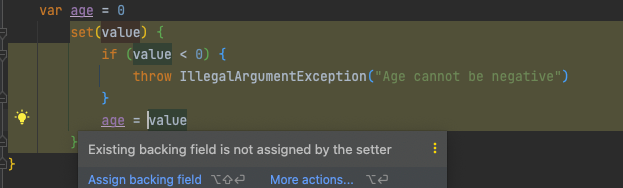

### field와 property

자바

- filed + getter, setter 합쳐서 property라고 부름

코틀린

- 필드에 대한 접근자 메서드를 자동으로 만들어줌
- 접근자 메서드를 명시적으로 선언

### Backing field

> 프로퍼티의 값을 저장하기 위한 필드
>

- 적어도 하나의 접근자가 기본으로 구현되는 접근자를 사용하는 경우
- 커스텀 접근자가 field 키워드를 통해 backing field를 참조하는 경우

```kotlin
class Person(var name: String) {
    var age = 0
        set(value) {
            if (value < 0) {
                throw IllegalArgumentException("Age cannot be negative")
            }
            field = value
        }
}
```

- field = value를 통해 counter의 값을 변경

field 키워드를 사용하는 이유

```kotlin
class Person(var name: String) {
    var age = 0
        set(value) {
            if (value < 0) {
                throw IllegalArgumentException("Age cannot be negative")
            }
            age = value
        }
}
```



- 무한 재귀에 빠지게 된다.(인텔리제이가 위의 사진 처럼 알려주긴 한다.)

### Backing properties란?

- backing field에서 필요에 따라 커스텀 getter, setter를 만드는 경우에도 제약이 존재한다.
- getter는 반환 타입이 반드시 프로퍼티의 타입과 같아야 하기 때문

```kotlin
class Person(var name: String) {
    var age = 0
        set(value) {
            if (value < 0) {
                throw IllegalArgumentException("Age cannot be negative")
            }
            field = value
        }

		// backing properties
    private var _table: Map<String, Int>? = null
    val table: Map<String, Int>
        get() {
            if (_table == null) {
                _table = HashMap() // Type parameters are inferred
            }
            return _table ?: throw AssertionError("Set to null by another thread")
        }

		// backing field
    var table2: Map<String, Int> = HashMap()
        get() {
            if (field == null) {
                field = HashMap()
            }
            return field
        }

}
```

backing field vs backing properties

- 크게 다르지 않지만 backing properties는 backing field를 사용하지 않는다.

언제 backing properties를 사용하나?

```kotlin
private var _results: MutableList<List<Tile>> = mutableListOf()

val results: List<List<Tile>>
    get() = _results
```

- 기본 getter로 값을 반환하면 mutableList로 반환하게됨
- backing properties를 만들어 내부에서는 값이 변경되지만, getter를 통해 값을 외부로 넘겨줄 때는 불변 List로 변경하여 넘길 필요가 있을 경우

커스텀 getter vs 기본 setter

1

```kotlin
private val _results: MutableList<List<Mark>> = mutableListOf()

val results: List<List<Mark>>
    get() = _results
```

2

```kotlin
private val _results: MutableList<List<Mark>> = mutableListOf()

val results: List<List<Mark>> = _results
```

- 1번은 result를 getter를 가져올 때 _result값을 반환
- 초기화 할 때 result에 _result 값이 세팅됨
    - 중간에 _result 값이 바뀌는 경우에 변경된 값을 가져오지 않고 초기 세팅 _result 값을 받아옴